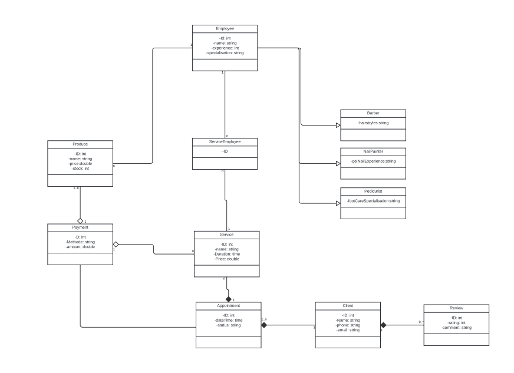

# Projekt_Salon
Das Ziel der Anwendung ist es, die Abläufe eines Salons zu digitalisieren und zu automatisieren. Dies umfasst die Verwaltung von Terminen, die Erbringung von Dienstleistungen (z. B. Haarschnitt, Maniküre), die Interaktion mit Kunden und die Erfassung von Bewertungen.
1. Terminbuchung:
   Ein Kunde meldet sich über die Anwendung an oder ruft im Salon an.
   Der Kunde wählt eine Dienstleistung (z. B. Haarschnitt).
   Der Kunde wählt einen verfügbaren Mitarbeiter (z. B. Module.Barber) und eine Uhrzeit.
   Der Termin wird in das System eingetragen und dem Mitarbeiter zugewiesen.
2. Bezahlung eines Termins oder Produkts:
   Nach Abschluss der Dienstleistung bezahlt der Kunde entweder direkt im Salon oder über die Anwendung.
   Die Zahlung wird im System registriert, und der Zahlungsstatus wird auf "bezahlt" gesetzt.
   Eine Quittung wird automatisch generiert.
3. Kundenbewertung:
   Nach der Dienstleistung erhält der Kunde eine Anfrage, eine Bewertung abzugeben.
   Die Bewertung wird im System gespeichert und ist für zukünftige Kunden sichtbar.
4. 